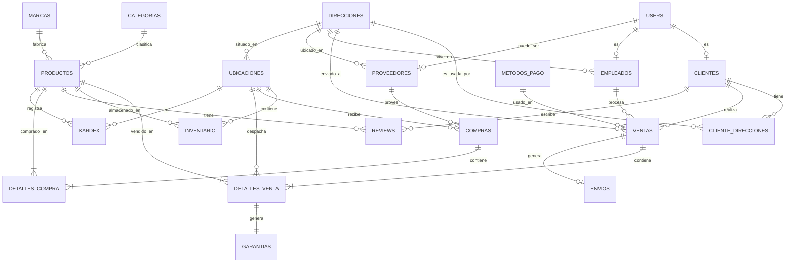

# 2. Diseño Relacional

## 2.1 Diagrama Entidad-Relación (Conceptual)



## 2.2 Modelo Relacional Detallado

### 2.2.1 Tablas de Catálogos y Configuración

#### `direcciones`
```sql
direcciones (
    id SERIAL PRIMARY KEY,
    calle VARCHAR(255) NOT NULL,
    ciudad VARCHAR(100) NOT NULL,
    estado VARCHAR(100) NOT NULL,
    codigo_postal VARCHAR(20),
    pais VARCHAR(100) DEFAULT 'Bolivia',
    created_at TIMESTAMPTZ DEFAULT CURRENT_TIMESTAMP,
    updated_at TIMESTAMPTZ DEFAULT CURRENT_TIMESTAMP
)
```
**Propósito**: Almacena direcciones físicas reutilizables. Normalización evita duplicación.

#### `categorias`
```sql
categorias (
    id SERIAL PRIMARY KEY,
    nombre VARCHAR(100) NOT NULL UNIQUE,
    descripcion TEXT,
    activa BOOLEAN DEFAULT TRUE,
    created_at TIMESTAMPTZ DEFAULT CURRENT_TIMESTAMP,
    updated_at TIMESTAMPTZ DEFAULT CURRENT_TIMESTAMP
)
```
**Propósito**: Clasificación de productos (Smartphones, Laptops, Gaming, Audio, etc.)
**Constraint**: UNIQUE en nombre previene duplicados

#### `marcas`
```sql
marcas (
    id SERIAL PRIMARY KEY,
    nombre VARCHAR(100) NOT NULL UNIQUE,
    pais_origen VARCHAR(50),
    sitio_web VARCHAR(255),
    created_at TIMESTAMPTZ DEFAULT CURRENT_TIMESTAMP,
    updated_at TIMESTAMPTZ DEFAULT CURRENT_TIMESTAMP
)
```
**Propósito**: Fabricantes de productos (Apple, Samsung, NVIDIA, etc.)

#### `metodos_pago`
```sql
metodos_pago (
    id SERIAL PRIMARY KEY,
    nombre VARCHAR(50) NOT NULL UNIQUE,
    activo BOOLEAN DEFAULT TRUE,
    created_at TIMESTAMPTZ DEFAULT CURRENT_TIMESTAMP,
    updated_at TIMESTAMPTZ DEFAULT CURRENT_TIMESTAMP
)
```
**Propósito**: Catálogo de formas de pago (efectivo, tarjeta, transferencia, QR, PayPal)

#### `ubicaciones`
```sql
ubicaciones (
    id SERIAL PRIMARY KEY,
    nombre VARCHAR(100) NOT NULL UNIQUE,
    tipo VARCHAR(20) NOT NULL CHECK (tipo IN ('tienda', 'almacen')),
    direccion_id INTEGER REFERENCES direcciones(id),
    created_at TIMESTAMPTZ DEFAULT CURRENT_TIMESTAMP
)
```
**Propósito**: Tiendas físicas y almacenes donde se almacena inventario
**Constraint CHECK**: Solo permite 'tienda' o 'almacen' como tipos

### 2.2.2 Autenticación y Usuarios

#### `users`
```sql
users (
    id SERIAL PRIMARY KEY,
    nombre VARCHAR(255) NOT NULL,
    email VARCHAR(255) UNIQUE NOT NULL,
    password TEXT NOT NULL,
    rol VARCHAR(20) NOT NULL DEFAULT 'cliente' CHECK (rol IN ('admin', 'empleado', 'cliente', 'proveedor')),
    foto_url TEXT,
    created_at TIMESTAMPTZ DEFAULT CURRENT_TIMESTAMP,
    updated_at TIMESTAMPTZ DEFAULT CURRENT_TIMESTAMP
)
```
**Propósito**: Autenticación unificada para todos los actores del sistema
**Características**:
- Email único (UNIQUE constraint)
- Password hasheado con Argon2
- Roles diferenciados con CHECK constraint
- Índice en email para login rápido

### 2.2.3 Entidades Principales

#### `clientes`
```sql
clientes (
    id SERIAL PRIMARY KEY,
    nombre VARCHAR(100) NOT NULL,
    apellido VARCHAR(100),
    telefono VARCHAR(20),
    tipo VARCHAR(20) DEFAULT 'consumidor_final' CHECK (tipo IN ('consumidor_final', 'empresa')),
    fecha_registro TIMESTAMPTZ DEFAULT CURRENT_TIMESTAMP,
    activo BOOLEAN DEFAULT TRUE,
    user_id INTEGER UNIQUE REFERENCES users(id) ON DELETE CASCADE,
    updated_at TIMESTAMPTZ DEFAULT CURRENT_TIMESTAMP
)
```
**Relación**: 1:1 con users (un user puede ser cliente)
**Constraint**: user_id UNIQUE garantiza que un user solo sea un cliente

#### `cliente_direcciones` (Tabla de Relación N:M)
```sql
cliente_direcciones (
    id SERIAL PRIMARY KEY,
    cliente_id INTEGER NOT NULL REFERENCES clientes(id) ON DELETE CASCADE,
    direccion_id INTEGER NOT NULL REFERENCES direcciones(id) ON DELETE CASCADE,
    alias VARCHAR(50),
    es_principal BOOLEAN DEFAULT FALSE,
    created_at TIMESTAMPTZ DEFAULT CURRENT_TIMESTAMP,
    updated_at TIMESTAMPTZ DEFAULT CURRENT_TIMESTAMP,
    CONSTRAINT cliente_direcciones_unico UNIQUE (cliente_id, direccion_id)
)
```
**Propósito**: Permite múltiples direcciones por cliente (casa, trabajo, etc.)
**Constraint UNIQUE**: Evita duplicar la misma dirección para un cliente

#### `empleados`
```sql
empleados (
    id SERIAL PRIMARY KEY,
    nombre VARCHAR(100) NOT NULL,
    apellido VARCHAR(100),
    telefono VARCHAR(20),
    puesto VARCHAR(20) DEFAULT 'vendedor' CHECK (puesto IN ('vendedor', 'gerente', 'administrativo')),
    fecha_contratacion DATE DEFAULT CURRENT_DATE,
    activo BOOLEAN DEFAULT TRUE,
    user_id INTEGER UNIQUE REFERENCES users(id) ON DELETE CASCADE,
    direccion_id INTEGER REFERENCES direcciones(id),
    updated_at TIMESTAMPTZ DEFAULT CURRENT_TIMESTAMP
)
```
**Relación**: 1:1 con users
**Constraint CHECK**: Solo permite puestos válidos

#### `proveedores`
```sql
proveedores (
    id SERIAL PRIMARY KEY,
    nombre VARCHAR(200) NOT NULL,
    contacto VARCHAR(100),
    telefono VARCHAR(20),
    email VARCHAR(255),
    activo BOOLEAN DEFAULT TRUE,
    user_id INTEGER REFERENCES users(id) ON DELETE SET NULL,
    direccion_id INTEGER REFERENCES direcciones(id),
    created_at TIMESTAMPTZ DEFAULT CURRENT_TIMESTAMP
)
```
**Nota**: user_id es opcional (ON DELETE SET NULL) ya que el proveedor existe independientemente

### 2.2.4 Productos e Inventario

#### `productos`
```sql
productos (
    id SERIAL PRIMARY KEY,
    nombre VARCHAR(200) NOT NULL,
    descripcion TEXT,
    precio NUMERIC(10,2) NOT NULL,
    precio_costo NUMERIC(10,2),
    categoria_id INTEGER REFERENCES categorias(id),
    marca_id INTEGER REFERENCES marcas(id),
    sku VARCHAR(50) UNIQUE,
    activo BOOLEAN DEFAULT TRUE,
    imagen_url TEXT,
    cantidad_minima INTEGER DEFAULT 5,
    dias_garantia INTEGER DEFAULT 365,
    fecha_creacion TIMESTAMPTZ DEFAULT CURRENT_TIMESTAMP,
    fecha_actualizacion TIMESTAMPTZ DEFAULT CURRENT_TIMESTAMP
)
```
**Características**:
- SKU único para identificación
- Precio y precio_costo separados (margen de ganancia)
- Soft delete con campo `activo`
- Garantía configurable por producto

#### `inventario`
```sql
inventario (
    id SERIAL PRIMARY KEY,
    producto_id INTEGER NOT NULL REFERENCES productos(id) ON DELETE CASCADE,
    ubicacion_id INTEGER NOT NULL REFERENCES ubicaciones(id) ON DELETE CASCADE,
    cantidad_disponible INTEGER NOT NULL DEFAULT 0 CHECK (cantidad_disponible >= 0),
    cantidad_reservada INTEGER NOT NULL DEFAULT 0 CHECK (cantidad_reservada >= 0),
    cantidad_minima INTEGER NOT NULL DEFAULT 5,
    ultima_actualizacion TIMESTAMPTZ DEFAULT CURRENT_TIMESTAMP,
    CONSTRAINT inventario_unico UNIQUE (producto_id, ubicacion_id)
)
```
**Propósito**: Stock multi-ubicación
**Constraint UNIQUE**: Un producto solo tiene un registro de inventario por ubicación
**CHECK constraints**: Previenen cantidades negativas

#### `reviews`
```sql
reviews (
    id SERIAL PRIMARY KEY,
    producto_id INTEGER NOT NULL REFERENCES productos(id) ON DELETE CASCADE,
    cliente_id INTEGER NOT NULL REFERENCES clientes(id) ON DELETE CASCADE,
    calificacion SMALLINT NOT NULL CHECK (calificacion BETWEEN 1 AND 5),
    comentario TEXT,
    verificado BOOLEAN DEFAULT FALSE,
    fecha_review TIMESTAMPTZ DEFAULT CURRENT_TIMESTAMP,
    CONSTRAINT reviews_unico UNIQUE (producto_id, cliente_id)
)
```
**Constraint UNIQUE**: Un cliente solo puede hacer una review por producto
**CHECK**: Calificación entre 1 y 5 estrellas

### 2.2.5 Transacciones de Compra

#### `compras`
```sql
compras (
    id SERIAL PRIMARY KEY,
    proveedor_id INTEGER REFERENCES proveedores(id),
    ubicacion_id INTEGER NOT NULL REFERENCES ubicaciones(id),
    fecha_compra TIMESTAMPTZ DEFAULT CURRENT_TIMESTAMP,
    numero_factura VARCHAR(100),
    total NUMERIC(10,2) NOT NULL,
    estado VARCHAR(20) DEFAULT 'completada',
    fecha_registro TIMESTAMPTZ DEFAULT CURRENT_TIMESTAMP
)
```
**Propósito**: Encabezado de órdenes de compra a proveedores
**ubicacion_id**: Define dónde ingresa la mercancía

#### `detalles_compra`
```sql
detalles_compra (
    id SERIAL PRIMARY KEY,
    compra_id INTEGER REFERENCES compras(id) ON DELETE CASCADE,
    producto_id INTEGER REFERENCES productos(id),
    cantidad INTEGER NOT NULL,
    precio_unitario NUMERIC(10,2) NOT NULL,
    subtotal NUMERIC(10,2) GENERATED ALWAYS AS (cantidad::numeric * precio_unitario) STORED,
    created_at TIMESTAMPTZ DEFAULT CURRENT_TIMESTAMP
)
```
**Columna Calculada**: `subtotal` se genera automáticamente (STORED)
**Trigger**: Al insertar, actualiza inventario automáticamente

### 2.2.6 Transacciones de Venta

#### `ventas`
```sql
ventas (
    id SERIAL PRIMARY KEY,
    codigo_venta VARCHAR(50) UNIQUE NOT NULL DEFAULT gen_random_uuid()::text,
    cliente_id INTEGER REFERENCES clientes(id),
    empleado_id INTEGER REFERENCES empleados(id),
    fecha TIMESTAMPTZ DEFAULT CURRENT_TIMESTAMP,
    subtotal NUMERIC(10,2) NOT NULL,
    impuestos NUMERIC(10,2) DEFAULT 0,
    total NUMERIC(10,2) NOT NULL,
    estado VARCHAR(20) DEFAULT 'pendiente' CHECK (estado IN ('pendiente', 'completada', 'cancelada')),
    metodo_pago_id INTEGER REFERENCES metodos_pago(id),
    direccion_id INTEGER REFERENCES direcciones(id)
)
```
**Características**:
- Código único generado automáticamente (UUID)
- Estados controlados con CHECK constraint
- Dirección de envío vinculada directamente

#### `detalles_venta`
```sql
detalles_venta (
    id SERIAL PRIMARY KEY,
    venta_id INTEGER REFERENCES ventas(id) ON DELETE CASCADE,
    producto_id INTEGER REFERENCES productos(id),
    ubicacion_id INTEGER REFERENCES ubicaciones(id),
    cantidad INTEGER NOT NULL,
    precio_unitario NUMERIC(10,2) NOT NULL,
    descuento NUMERIC(10,2) DEFAULT 0,
    subtotal NUMERIC(10,2) GENERATED ALWAYS AS ((cantidad::numeric * precio_unitario) - descuento) STORED,
    created_at TIMESTAMPTZ DEFAULT CURRENT_TIMESTAMP
)
```
**Columna Calculada**: Subtotal incluye descuento
**ubicacion_id**: De dónde se despacha el producto (asignado automáticamente por trigger)
**Triggers**: 
1. Resta stock automáticamente
2. Genera garantía automáticamente

#### `envios`
```sql
envios (
    id SERIAL PRIMARY KEY,
    venta_id INTEGER NOT NULL UNIQUE REFERENCES ventas(id) ON DELETE CASCADE,
    direccion_id INTEGER NOT NULL REFERENCES direcciones(id),
    estado VARCHAR(20) DEFAULT 'entregado',
    costo DECIMAL(10,2) DEFAULT 50.00,
    fecha_envio TIMESTAMPTZ DEFAULT CURRENT_TIMESTAMP,
    fecha_entrega TIMESTAMPTZ DEFAULT CURRENT_TIMESTAMP,
    created_at TIMESTAMPTZ DEFAULT CURRENT_TIMESTAMP
)
```
**Relación 1:1**: Una venta genera un envío
**Trigger**: Se crea automáticamente al insertar venta

#### `garantias`
```sql
garantias (
    id SERIAL PRIMARY KEY,
    detalle_venta_id INTEGER NOT NULL UNIQUE REFERENCES detalles_venta(id) ON DELETE CASCADE,
    fecha_inicio DATE NOT NULL DEFAULT CURRENT_DATE,
    fecha_fin DATE NOT NULL,
    estado VARCHAR(20) DEFAULT 'activa' CHECK (estado IN ('activa', 'expirada', 'utilizada', 'cancelada')),
    detalles TEXT DEFAULT 'Sin detalles',
    created_at TIMESTAMPTZ DEFAULT CURRENT_TIMESTAMP
)
```
**Relación 1:1**: Cada producto vendido tiene su garantía
**Trigger**: Se genera automáticamente usando `dias_garantia` del producto

### 2.2.7 Auditoría y Trazabilidad

#### `kardex`
```sql
kardex (
    id SERIAL PRIMARY KEY,
    producto_id INTEGER REFERENCES productos(id),
    ubicacion_id INTEGER REFERENCES ubicaciones(id),
    fecha TIMESTAMPTZ DEFAULT CURRENT_TIMESTAMP,
    tipo_movimiento VARCHAR(20) NOT NULL,
    cantidad INTEGER NOT NULL,
    saldo_anterior INTEGER NOT NULL,
    saldo_actual INTEGER NOT NULL,
    referencia_tabla VARCHAR(50),
    referencia_id INTEGER,
    observacion TEXT
)
```
**Propósito**: Registro histórico de TODOS los movimientos de inventario
**Trigger**: Se registra automáticamente en INSERT/UPDATE de inventario
**Tipos de movimiento**: entrada, salida, entrada_inicial, ajuste_manual

## 2.3 Análisis de Normalización

### 2.3.1 Primera Forma Normal (1FN)

**Criterios 1FN**:
- ✅ Todos los atributos contienen valores atómicos (no multivaluados)
- ✅ No hay grupos repetidos
- ✅ Cada columna tiene un nombre único
- ✅ El orden de las filas es irrelevante

**Verificación**:

| Tabla | Cumple 1FN | Justificación |
|-------|------------|---------------|
| `productos` | ✅ | Todos los campos son atómicos (nombre, precio, categoria_id) |
| `clientes` | ✅ | Información de contacto en campos separados |
| `cliente_direcciones` | ✅ | Asociación N:M normalizada, sin arrays |
| `detalles_venta` | ✅ | Cada producto vendido es una fila individual |
| `inventario` | ✅ | Cantidad por ubicación en campos atómicos |

### 2.3.2 Segunda Forma Normal (2FN)

**Criterios 2FN**:
- ✅ Cumple 1FN
- ✅ No existen dependencias parciales (todos los atributos no-llave dependen de la llave completa)

**Análisis de Tablas con Claves Compuestas**:

#### `inventario` 
**Clave Compuesta**: (producto_id, ubicacion_id)

| Atributo | Depende de | Tipo Dependencia |
|----------|-----------|------------------|
| cantidad_disponible | (producto_id, ubicacion_id) | **Completa** ✅ |
| cantidad_reservada | (producto_id, ubicacion_id) | **Completa** ✅ |
| cantidad_minima | (producto_id, ubicacion_id) | **Completa** ✅ |

**Conclusión**: ✅ Cumple 2FN (no hay dependencias parciales)

#### `cliente_direcciones`
**Clave Compuesta**: (cliente_id, direccion_id)

| Atributo | Depende de | Tipo Dependencia |
|----------|-----------|------------------|
| alias | (cliente_id, direccion_id) | **Completa** ✅ |
| es_principal | (cliente_id, direccion_id) | **Completa** ✅ |

**Conclusión**: ✅ Cumple 2FN

### 2.3.3 Tercera Forma Normal (3FN)

**Criterios 3FN**:
- ✅ Cumple 2FN
- ✅ No existen dependencias transitivas (atributos no-llave no dependen de otros atributos no-llave)

**Análisis de Dependencias Transitivas**:

#### ✅ `productos`
```
id → nombre, precio, categoria_id, marca_id, sku
```
No hay dependencias transitivas. Los nombres de categoría y marca están en sus propias tablas.

**Antes de Normalización (Viola 3FN)**:
```
productos (id, nombre, precio, categoria_id, categoria_nombre, marca_id, marca_nombre)
```
❌ `categoria_id → categoria_nombre` es transitiva
❌ `marca_id → marca_nombre` es transitiva

**Después de Normalización (Cumple 3FN)** ✅:
```
productos (id, nombre, precio, categoria_id, marca_id)
categorias (id, nombre, descripcion)
marcas (id, nombre, pais_origen)
```

#### ✅ `ventas`
```
id → cliente_id, empleado_id, fecha, subtotal, impuestos, total, estado, metodo_pago_id, direccion_id
```
No hay dependencias transitivas. Los detalles de cliente, empleado, método de pago y dirección están en sus propias tablas.

#### ✅ `detalles_venta`
```
id → venta_id, producto_id, ubicacion_id, cantidad, precio_unitario, descuento
```
El campo `subtotal` es una **columna calculada** (GENERATED), no almacena datos redundantes modificables manualmente, por lo que no viola 3FN.

#### ✅ `clientes`
```
id → nombre, apellido, telefono, tipo, user_id
```
Las direcciones están en `cliente_direcciones` (tabla de relación N:M), no como atributos múltiples o transitivos.

#### ✅ `inventario`
```
(producto_id, ubicacion_id) → cantidad_disponible, cantidad_reservada, cantidad_minima
```
No hay atributos que dependan de otros atributos no-llave.

### 2.3.4 Resumen de Normalización

| Tabla | 1FN | 2FN | 3FN | Notas |
|-------|-----|-----|-----|-------|
| `users` | ✅ | ✅ | ✅ | Tabla de autenticación centralizada |
| `clientes` | ✅ | ✅ | ✅ | Separada de users para permitir múltiples roles |
| `empleados` | ✅ | ✅ | ✅ | Separada de users, mismo patrón |
| `proveedores` | ✅ | ✅ | ✅ | Entidad independiente |
| `productos` | ✅ | ✅ | ✅ | Referencias a catálogos separados |
| `categorias` | ✅ | ✅ | ✅ | Catálogo normalizado |
| `marcas` | ✅ | ✅ | ✅ | Catálogo normalizado |
| `direcciones` | ✅ | ✅ | ✅ | Reutilizable, evita duplicación |
| `cliente_direcciones` | ✅ | ✅ | ✅ | Relación N:M correcta |
| `inventario` | ✅ | ✅ | ✅ | Stock por ubicación sin redundancia |
| `ventas` | ✅ | ✅ | ✅ | Encabezado de transacción |
| `detalles_venta` | ✅ | ✅ | ✅ | Detalles con columna calculada |
| `compras` | ✅ | ✅ | ✅ | Encabezado de compra |
| `detalles_compra` | ✅ | ✅ | ✅ | Detalles con columna calculada |
| `reviews` | ✅ | ✅ | ✅ | Relación N:M controlada |
| `garantias` | ✅ | ✅ | ✅ | 1:1 con detalles_venta |
| `envios` | ✅ | ✅ | ✅ | 1:1 con ventas |
| `kardex` | ✅ | ✅ | ✅ | Auditoría de movimientos |
| `metodos_pago` | ✅ | ✅ | ✅ | Catálogo simple |
| `ubicaciones` | ✅ | ✅ | ✅ | Tiendas y almacenes |

**Conclusión General**: ✅ **El diseño cumple completamente con la Tercera Forma Normal (3FN)**

## 2.4 Justificación de Decisiones de Diseño

### 2.4.1 Uso de `users` como Tabla Central
**Decisión**: Crear tabla `users` separada de `clientes`, `empleados`, `proveedores`

**Justificación**:
- ✅ Un usuario puede tener múltiples roles (ej: empleado y cliente)
- ✅ Centraliza autenticación (un solo lugar para verificar credenciales)
- ✅ Flexibilidad para agregar roles futuros
- ✅ Evita duplicación de emails y passwords

### 2.4.2 Tabla de Relación `cliente_direcciones`
**Decisión**: Relación N:M entre clientes y direcciones

**Justificación**:
- ✅ Un cliente puede tener múltiples direcciones (casa, trabajo, etc.)
- ✅ Una dirección puede ser compartida (edificio de oficinas, etc.)
- ✅ Permite alias personalizados ("Oficina Central", "Casa")
- ✅ Control de dirección principal con flag `es_principal`

### 2.4.3 Inventario Multi-ubicación
**Decisión**: Constraint UNIQUE en (producto_id, ubicacion_id)

**Justificación**:
- ✅ Previene duplicación de registros de inventario
- ✅ Garantiza un solo registro de stock por producto/ubicación
- ✅ Facilita consultas de stock disponible
- ✅ Permite UPSERT en triggers de compras

### 2.4.4 Columnas Calculadas (GENERATED ALWAYS)
**Decisión**: `subtotal` calculado en `detalles_venta` y `detalles_compra`

**Justificación**:
- ✅ Evita inconsistencias (siempre es cantidad × precio - descuento)
- ✅ No viola 3FN (es derivado, no redundante modificable)
- ✅ Mejor rendimiento en consultas (no requiere cálculo en tiempo real)
- ✅ PostgreSQL lo recalcula automáticamente si cambian los datos base

### 2.4.5 Soft Delete en Productos
**Decisión**: Campo `activo` boolean en lugar de DELETE físico

**Justificación**:
- ✅ Mantiene integridad referencial con ventas históricas
- ✅ Permite reactivar productos
- ✅ Auditoría completa
- ✅ Reportes históricos precisos

### 2.4.6 Kardex como Tabla Separada
**Decisión**: No usar triggers de historial nativo de PostgreSQL

**Justificación**:
- ✅ Control total sobre qué se registra
- ✅ Incluye saldo_anterior y saldo_actual para fácil auditoría
- ✅ Referencias genéricas (referencia_tabla, referencia_id) para rastrear origen
- ✅ Consultas más simples que revisar logs del sistema

### 2.4.7 Relaciones 1:1 (Garantías, Envíos)
**Decisión**: Tablas separadas en lugar de columnas en `ventas`/`detalles_venta`

**Justificación**:
- ✅ No todas las ventas requieren envío (ej: compra en tienda)
- ✅ Información específica de envío (tracking, costo, fechas)
- ✅ Garantías por producto vendido, no por venta completa
- ✅ Facilita extensibilidad (agregar campos sin modificar tabla principal)

---

**Próximo Documento**: [03-SCRIPTS-SQL.md](./03-SCRIPTS-SQL.md)
